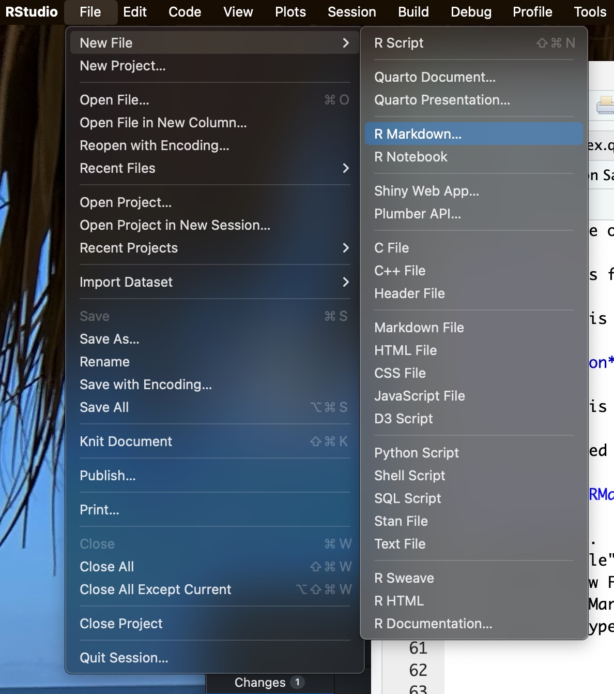
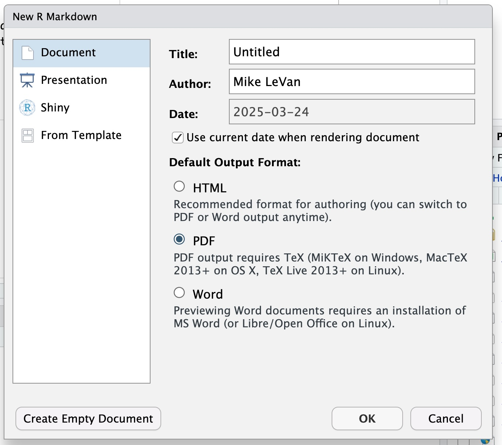
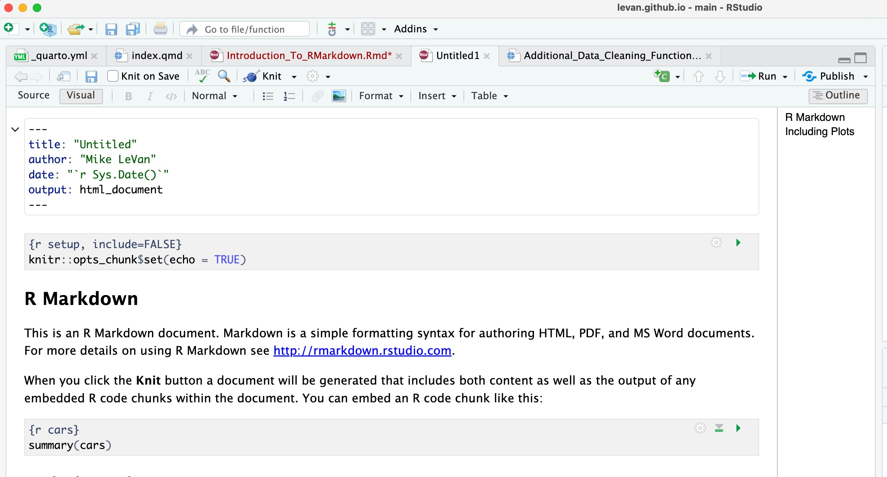

```{r setup, include=FALSE}
knitr::opts_chunk$set(echo = TRUE)
```

# Introduction to RMarkdown

Now that we have seen the steps involved with being a data scientist, we need
to start thinking about how we can communicate our results. One way to do this
is to use **RMarkdown**. RMarkdown is a way to combine R code with text to create
a document that can be shared with others.

RMarkdown is a combination of three things:

1. **Markdown**: A simple formatting syntax for authoring HTML, PDF, and MS Word documents.
2. **R**: A programming language that is used for data analysis and visualization.
3. **YAML**: A human-readable data serialization format that is used for configuration files. We
won't worry about these too much for now.

We can also throw in a little LaTex to make our documents look even better!
<br>

RMarkdown is a branch of the Markdown language. You have been using a version of
the Markdown language almost every time you visit a website. HTML documents are
called Hyper Text Markup Language documents. Markdown is a simplified version
of HTML that allows you to create documents with simple formatting. For example,
you can create headers, lists, links, and insert images in Markdown. Therefore,
RMarkdown is a combination of R code and Markdown. This allows us to create documents
that can create reports, papers, and presentations that include the R code used to
generate the results. This is great for reproducibility and transparency in data analysis.
<br>

Here is a list of some of the different types of RMarkdown documents that we can create:

1. **HTML**: This is the default output format for RMarkdown documents. It is great for sharing
documents online or via email.

2. **PDF**: This format is great for creating printable documents that can be shared with others.

3. **Word**: This format is great for sharing documents with people who don't use R or RMarkdown.

4. **Presentation**: This format is great for creating slideshows that can be presented to an audience.

5. **Book**: This format is great for creating books or long-form documents that can be shared online.

Let's get started by seeing how to create an RMarkdown document in RStudio.

## Creating an RMarkdown Document

<table style="width:80%;">
  <tr>
    <td style="width:40%;">1) Open RStudio. </td>
    <td rowspan="4">{width="50%"}</td>
  </tr>
  <tr>
    <td>2) Click on "File" in the top menu.</td>
  </tr>
  <tr>
    <td>3) Click on "New File".</td>
  </tr>
  <tr>
    <td>4) Click on "R Markdown".</td>
  </tr>
</table>
<br>

At this point we are ready to choose the type of document you want to 
create (HTML, PDF, Word, etc.).
<br>
<center>
{width="40%"}
</center>
<br>

For now we will choose "PDF" and click "OK". This will create a new RMarkdown
document with some default text and code. We can now start editing the document.
<br>

<center>
{width="40%"}
</center>

## Editing an RMarkdown Document


